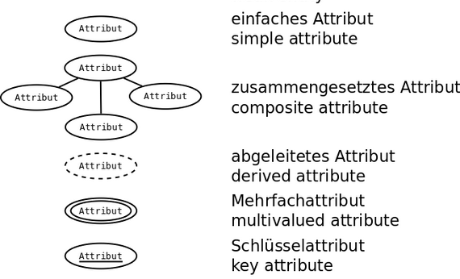

Die **Attribute in einer Entität** können unterschiedlich aufgebaut sein.

→  Man **unterscheidet** zwischen **zusammengesetzte, mehrwertige und abgeleitete Attribute**.

# Typen

**Einfaches Attribut:**&#x20;

- Einfache Eigenschaft einer Entity
- Beispiel:
  - "Größe" zur Entity Person

### Schlüsselattribut:&#x20;

- eindeutiger Primärschlüssel (Key attribut)
- Einmaliges und identifizierendes Attribut um einen Eintrag einer bestimmten Entität zu finden
- Beispiel:
  - &#x20;Jeder Kunde hat eine eindeutige Kundennummer bzw. Schlüsselattribut
- Kann auch als zusammengesetzter Primärschlüssel genutzt werden: mehrere Attribute die zusammen ein Schlüsselattribut ergeben
- Dieses wird unterstrichen um es zu makieren.

### Mehrwertiges Attribut:

- Ein Attribut das selber Attribute zugeordnet bekommt
- Beispiel:&#x20;
  - Student kann gleichzeitig in zwei Studiengänge eingeschrieben sein

### Zusammengesetztes Attribut:

- Kombination mehrerer Attribute, die inhaltlich zusammengehören.
- Beispiel:&#x20;
  - Die **Firmenadresse selbst ist ein Attribut der Firma**, sie enthält aber die Attribute Straße, Hausnummer, Postleitzahl und Ort

 

TODO

Superschlüssel

Schlüsselkandidaten: minimale Superschlüssel

Primärschlüssel: ausgewälter Schlüsselkandidat

Fremdschlüssel

# Attribute im ER-Modell:&#x20;

 
