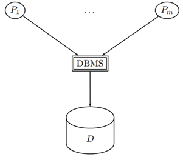

# Defintion:&#x20;

**Informationssystem** zum:&#x20;

- Speichern
- Auffinden
- Berarbeiten und
- Auswerten

von **großen Datenmengen**&#x20;

# Beispiele:&#x20;

- Bestellsysteme bei Online-Kaufhändlern
- Kundenverwaltung
- Suchmaschienen
- und vieles mehr...

# Komponenten

**Datenbase \[DB] :**&#x20;

- Eigentliche Nutzerdaten

**Datenbankmanagementsystem \[DBMS]**

- Software, welche die Datenbase verwaltet bzw. Zugriff regelt
- **z.B** können so **Benutzernamen** sowie **Passwörter** vergeben werden oder es können **Benutzergruppen** (= neue Tabellen) erstellt werden

**Datenbanksystem \[DB + DBMS]:**&#x20;

- Software die beides vereinigt

# Nutzertypen:&#x20;

Auf einer Datenbank kann editiert und gelesen werden und rechte werden verwaltet etc.  So gibt es verschiedene Typen von Nutzer die jeweils unterschiedlich mit der Datenbank.&#x20;

- **Admin**
  - Vordefinierte User dem alle Rechte der Datenbak gehören
- **Anwendungsprogrammierer:**&#x20;
  - Programmiert das Datenbankmanagementsystem DB/DBMS&#x20;
- **DB Designer**
  - Entscheidet welche Entities mit welchen Attributen und Relations benoetigt werden
    - → Konstruiert das Tabellengerüst
- **Endbenutzer:**
  - &#x20;Gibt values in die Datenbank ein (direkt oder indirekt)&#x20;
    - Beispiele:&#x20;
      - Nutzer tätigt eine Online Bestellung: indirekt wird ein neuer Wert erstellt
      - Mitarbeiter editiert manuell Daten in der Datenbank **über das DBMS**

 

Zugriff der Endbenutzer (p1, ..., pm) auf die Datenbank (D) wird nur über das DBMS getan:

 

Beim Designen einer Anwendung die mit der Reelen Welt (Realwelt) arbeitet, wird erst einmal eine Miniwelt mit ausschließlich die relevanten Dinge erschaffen (das ER-Modell), die dann schlussendlich in eine richtige Datenbank (die Rechnerwelt) konvertiert wird.

 

 
