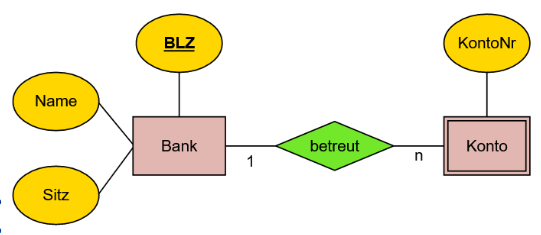
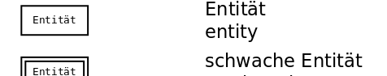

# Entitäten

Eine (starke) Entiät ist ein individuell identifizierbares Objekt der Wirklichkeit.

Es wird mit mehreren Attributen beschrieben (die Eigentschaften des Objektes).

Um sie Identifizierbar zu machen, benötigt sie immer (mindestens) ein **Schlüsselattribut**.

# Schwache Entitäten

Eine schwache Entität muss mit einer starken Entität zusammen definiert werden damit jeder Wert identifizierbar wird: die eigenen Attribute reichen alleine nicht aus um jedes Element einzigartig zu machen. In kombination mit der Starken Entität wird jede Schwache Entität wieder identifizier bar.

Beispiel:

Das Schlüsselattribut für jedes Konto wäre in diesem Fall BLZ+KontoNr.

# Entity im ER-Modell:&#x20;

 
