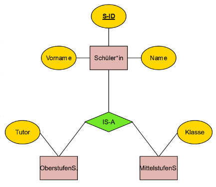

Bei einer IS-A Beziehung erben Entitäten (Subtyp) die Attribute einer "ober-Entität" (Supertyp), doch können auch weitere Attribute Definieren. Es gibt nur ein Primärschlüssel der gleich bei dem Super- und Subtyp ist.

Beispiel:

Jeder Oberstufen Schüler besitzt die Attribute: "S-ID", "Name", "Vorname" und "Tutor".

Jeder Mittelstufen Schüler besitzt die Attribute: "S-ID", "Name", "Vorname" und "Klasse".
